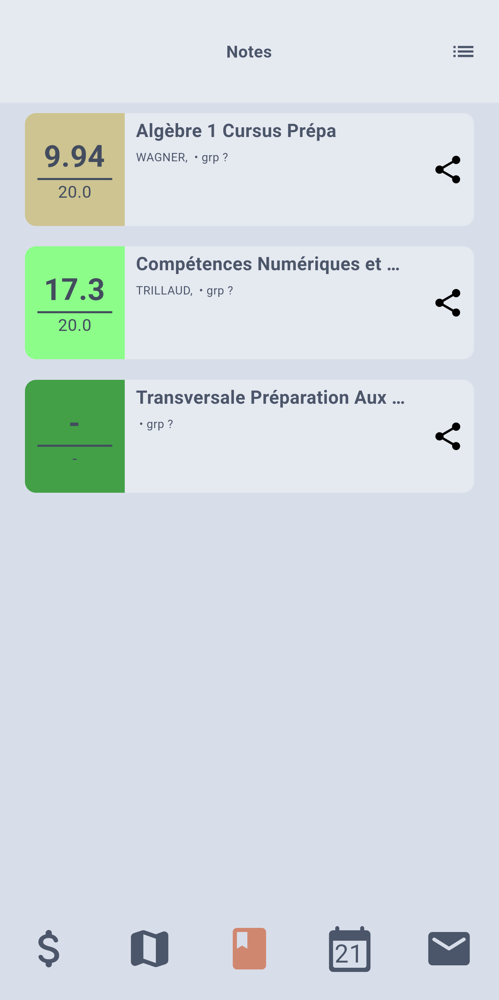
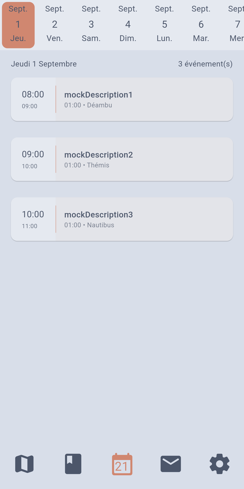
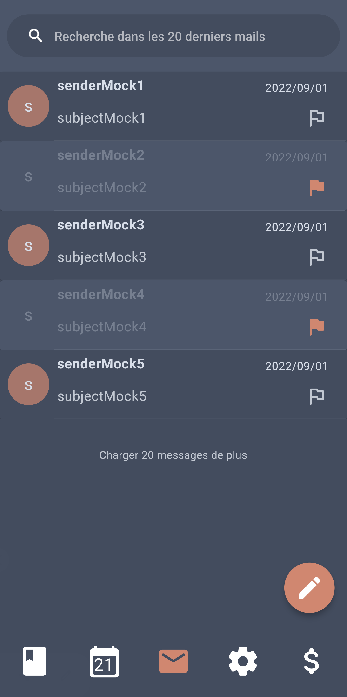
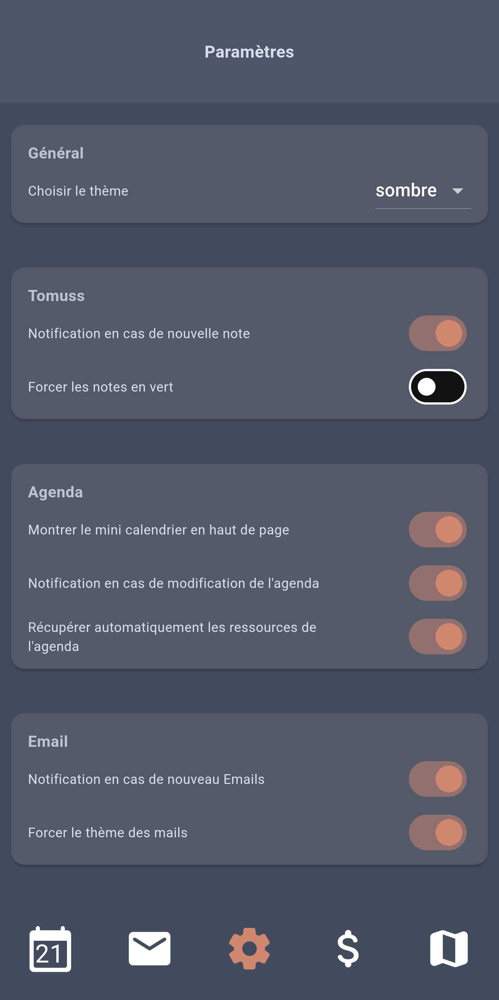
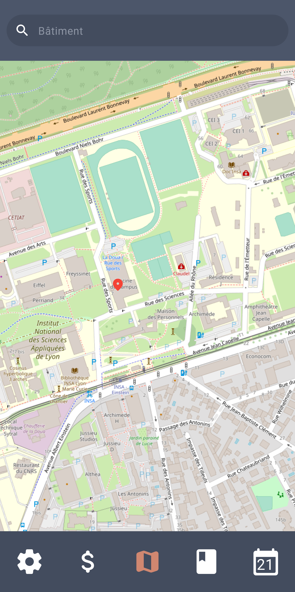

# Onyx

Onyx is an application to access all Université Claude Bernard Lyon 1 's services from your phone.\

|||
|:-:|:-:|
|Toutes tes notes en un clin d'oeil⚡|Ton emploi du temps sans rien n'avoir à configurer 🥳|
|||
|Tes mails toujours disponibles 🤩|Plein de paramètres pour une application comme tu la veux ❤️‍🔥|
|||
|Izly, Tu peut supprimer l'app Izly🧹|Un plan des bâtiments pour cet amphi que personne ne connait😢|
|||

## contribute

Feel free to contribute to this project by opening issues or pull requests.\
We really appreciate any help.

### run the integration test

start app in test
mode : `flutter run integration_test/app_test.dart --host-vmservice-port 9753 --disable-service-auth-codes --dart-define CONVENIENT_TEST_MANAGER_HOST="an ip address" --dart-define CONVENIENT_TEST_APP_CODE_DIR=/path/to/onyx`

replace `an ip address` with the ip address of your computer (if using an emulator, set to 10.0.2.2)
replace `/path/to/onyx` with the path to the onyx directory

run the test manager (can be found here : https://github.com/fzyzcjy/flutter_convenient_test/)
`flutter run packages/convenient_test_manager/lib/main.dart --profile --dart-define CONVENIENT_TEST_WORKER_HOST="an ip address" -d linux`

replace `an ip address` with the ip address of your phone (if using an emulator, set to 127.0.0.1)

replace `linux` with your operating system

common issue :

- you will maybe need to install vlc-dev on linux to be able to compile the test manager
- enable isolation in the test manager to run all the tests at once

## licence

This work is licensed under the Creative Commons Attribution-NonCommercial 4.0 International License. To view a copy of this license, visit http://creativecommons.org/licenses/by-nc/4.0/ or send a letter to Creative Commons, PO Box 1866, Mountain View, CA 94042, USA.\
