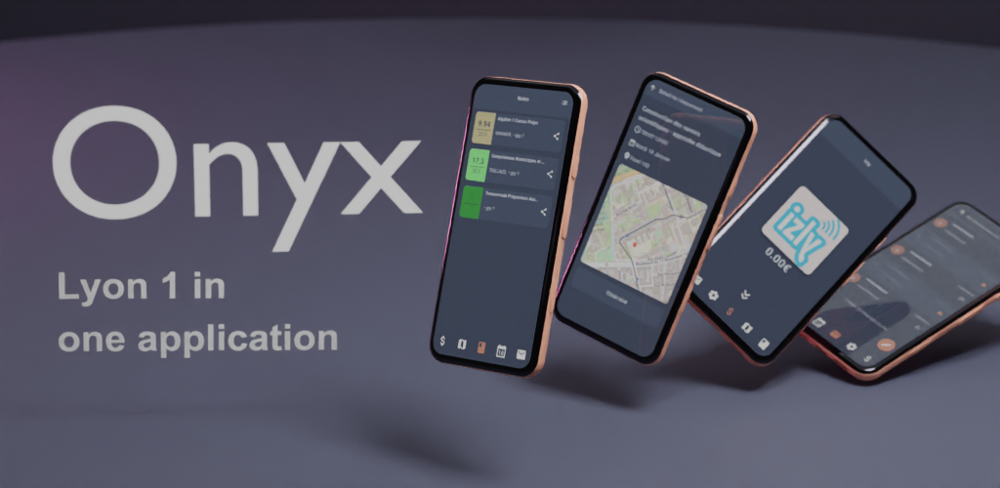
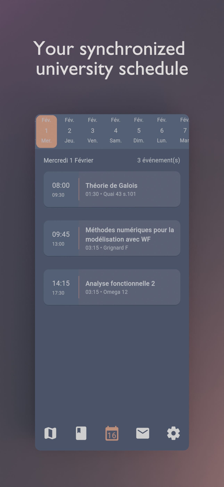
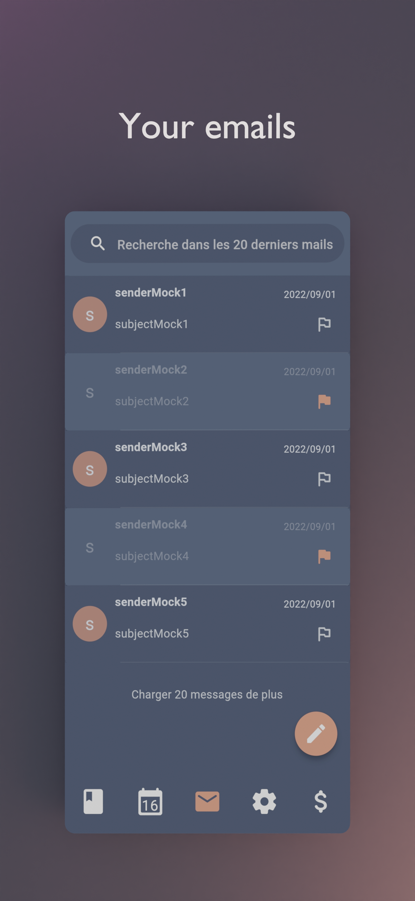
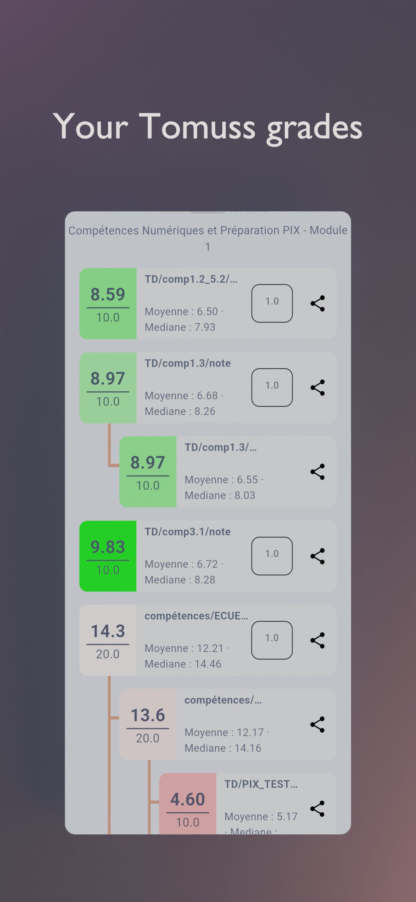
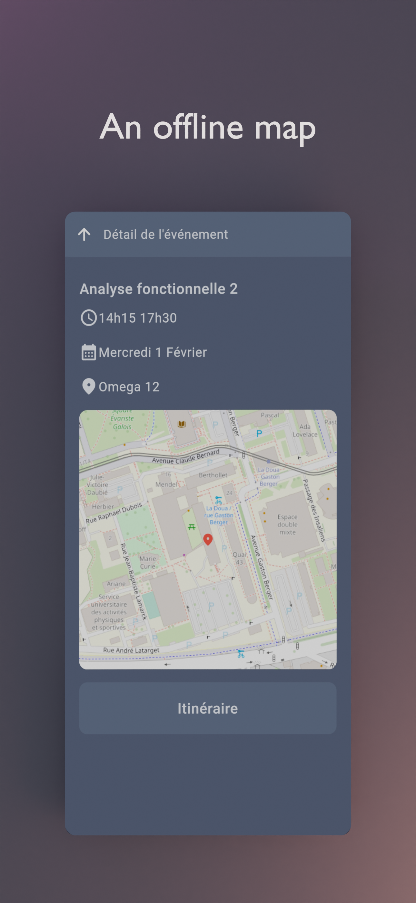
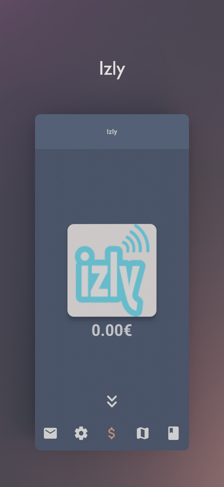

<!--suppress HtmlUnknownAnchorTarget, CheckImageSize -->
<h1 style="text-align: center;">
  <a href="https://onyx-lyon1.github.io" style="display: block; text-align: center;">
    
  </a>
  <br>
  Onyx : Everything for Lyon 1
  <br>
</h1>

<h4 align="center">The student application for Claude Bernard Lyon 1 University </h4>

<p align=center>
    <a href="https://github.com/onyx-lyon1/onyx/releases">
      
    </a>
    <a href="https://play.google.com/store/apps/details?id=fr.onyx.lyon1&pcampaignid=web_share">
      
    </a>
    <a href="https://creativecommons.org/licenses/by-nc/4.0/">
      
    </a>
    <a href="https://discord.gg/AtCc3pcaNm">
      
    </a>
  </p>

<p align=center>
  <a href="#features">Features</a> | 
  <a href="#download">Download</a> | 
  <a href="#contribute">Contribute</a> | 
  <a href="#build">Build</a> | 
  <a href="#license">License</a>
</p>



Onyx is an unofficial, open-source application that lets you access all Université Claude Bernard Lyon 1 services from
your phone.

## Features

<p align=center>
  
  
  
  
  
</p>

## Download

<p align=center>
<a href='https://play.google.com/store/apps/details?id=fr.onyx.lyon1&pcampaignid=web_share&pcampaignid=pcampaignidMKT-Other-global-all-co-prtnr-py-PartBadge-Mar2515-1'></a>
<!--<a href='https://play.google.com/store/apps/details?id=fr.onyx.lyon1&pcampaignid=web_share&pcampaignid=pcampaignidMKT-Other-global-all-co-prtnr-py-PartBadge-Mar2515-1'></a>-->
<a href='https://github.com/onyx-lyon1/onyx/releases'></a>
<a href='https://apps.apple.com/app/onyx-everything-for-lyon-1/id6462440486
'></a>
</p>

## Contribute

An application for students, by students. Feel free to contribute to this project by opening issues or pull requests.
We really appreciate any help. You can also chat with us on [Discord](https://discord.gg/AtCc3pcaNm).

## Build

To build the app, follow these steps:

### Prerequisites 🛠️

- Install Flutter from [flutter.dev](https://flutter.dev).

- #### Linux
  You will need those libraries:
    - pkg-config
    - libgtk3
    - libglib2
    - libsecret

  On Debian/Ubuntu like distros, they can be installed with this single command :
  ```shell 
  sudo apt install pkg-config libgtk-3-dev libglib2.0-dev libsecret-1-dev
  ```
- #### Android
  You will need a recent version of [Android Sdk](https://developer.android.com/studio).

  You can then run `flutter doctor` to check if it's detected by flutter.

### Building the App 🏗️

Please make sure you are on the main branch before proceeding with the build process.
Navigate to the `apps/onyx` directory and execute the following command based on your
target platform:

- To build an APK: `flutter build apk --profile` (the `--profile` flag build the app without the signing key but with
  full optimizations)
    - The APK file is located at `apps/onyx/build/app/outputs/flutter-apk/app-release.apk`.
- To build for Linux: `flutter build linux`
    - The Linux build is located at `apps/onyx/build/linux/x64/release/bundle/Onyx`.
- To build an app bundle: `flutter build appbundle --profile` (the `--profile` flag build the app without the signing
  key but with full optimizations)
    - The app bundle is located at `apps/onyx/build/app/outputs/bundle/release/app-release.aab`.
- For other platforms, please refer to the Flutter documentation for their respective build locations.

### Development Environment Setup ⚙️

To set up your development environment:

1. The required libraries are located in the `packages/` directory.
2. Install Melos, which handles linking libraries directly in the app for development:
    - Install Melos by running: `dart pub global activate melos`.
    - Refer to the [Melos documentation](https://melos.invertase.dev/) for more details.
3. Run `melos bs` or `melos bootstrap` to link the local libraries in the app and retrieve all dependencies.
4. Navigate to the `apps/onyx` directory and run `flutter clean` to ensure a clean environment.
5. Run `flutter run` to start the app.
6. Optionally, you can use `melos generate` to generate automatically generated files (usually not needed unless you
   modify them).
7. Run `melos test` to run unit tests for all the libraries.
8. Run `melos analyze` to perform static analysis on the libraries and the Onyx app.
9. To unlink everything, use `melos clean`.
10. You may have to use the agenda ids with your keys, to prevent commiting them, you can
    use `git update-index --assume-unchanged apps/onyx/assets/key.txt`
    and `git update-index --assume-unchanged apps/onyx/assets/iv.txt` to ignore
    changes to this file.

### android emulation

if you are using the flake, to create an virtual device, run : `avdmanager create avd --force --name phone --package 'system-images;android-33;google_apis_playstore;x86_64'`
then to run it simply run : `emulator -avd phone -skin 720x1280`

### End-to-End Testing 🧪

To run end-to-end tests:

1. Install Maestro by following the [Maestro documentation](https://maestro.mobile.dev/).
2. Run the following command to install Maestro: `curl -Ls "https://get.maestro.mobile.dev" | bash` (Applicable for Mac
   OS, Linux, or Windows with WSL)
3. Navigate to the `apps/onyx/integration_test` directory.
    4. After installing the app on an Android device (physical or virtual), run the following command to execute the
       tests: `maestro test general_test.yaml` Maestro will automatically run the tests.

Now, you're all set to build and test your Flutter app. 🎉

## License

This work is licensed under the GPL-3.0 License. To view a copy of
this license, visit https://www.gnu.org/licenses/

<p align=center>
  
  <br> <br>
  
</p>
